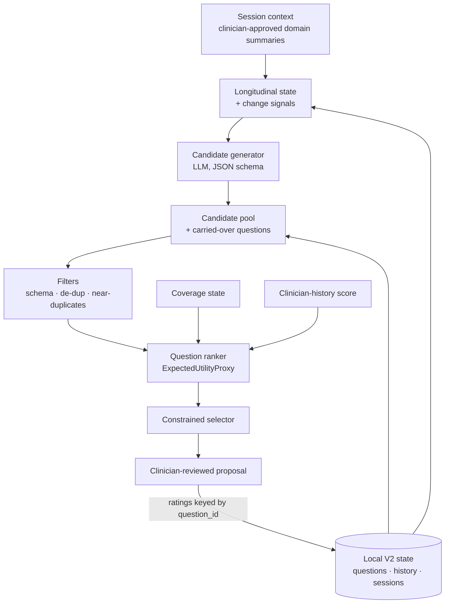
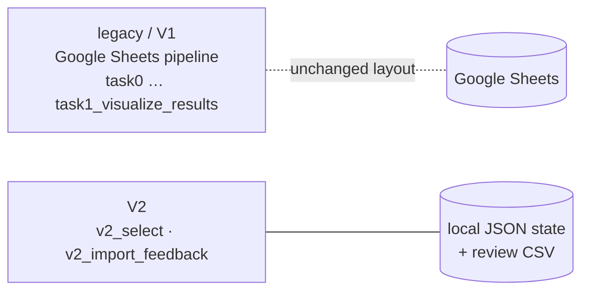

# Adaptive LLM-Generated Questionnaires for Suicide Risk Assessment

### A Clinical Pilot in Greece

[](https://doi.org/10.17605/osf.io/vcjrm)
[](https://doi.org/10.17605/osf.io/vcjrm)
[](#ethics--safety)
[](LICENSE)
[](#repository-layout)

> **Fork notice.** This is a fork of
> [`dimigeorgiou/adaptive-llm-questionnaires-suicide-risk`](https://github.com/dimigeorgiou/adaptive-llm-questionnaires-suicide-risk).
> Everything down to "License" is the original authors' README, unchanged. The fork's experimental
> additions are described in [Experimental Adaptive Questioning V2](#experimental-adaptive-questioning-v2)
> and in [`CHANGELOG.md`](CHANGELOG.md). The fork is not endorsed by the original authors.


> **Companion code** for the NICE TEAS Europe 2026 paper.  
> Clinician-supervised, LLM-assisted generation and weekly adaptation of personalized suicide-risk questionnaires — supporting clinical judgment, not replacing it.

**Paper PDF / publisher DOI:** _link forthcoming_ · **OSF registration:** [doi:10.17605/osf.io/vcjrm](https://doi.org/10.17605/osf.io/vcjrm)

---

## Abstract

This study presents an early-stage clinical pilot of an adaptive system that leverages large language models (LLMs) to generate personalized questionnaires for suicide risk assessment within a preventive therapeutic context. The framework combines LLM-driven question generation, fuzzy logic–based adaptation, and patient history to iteratively tailor questionnaire content under continuous clinician supervision. The system has been deployed in a psychosocial rehabilitation setting in Athens, Greece (KLIMAKA), where dynamically adapted questionnaires are integrated into routine clinical care.

---

## Contributions

1. **LLM-based question generation** grounded in patient history and clinician prompts (Google Sheets HITL).
2. **Weight-based / fuzzy adaptive selection** using five Likert engagement dimensions.
3. **Human-in-the-loop validation** — clinicians score items, write session notes, and gate every replacement cycle.
4. **Longitudinal analytics exports** (CSV / JSON / plots) for transparency and secondary analysis.

---

## Method (pipeline)

```text
Patient history (Sheets)
        │
        ▼
   [task0]  LLM → initial questionnaire (5 categories × 4 items = 20)
        │
        ▼
   [task1_preparation]  Parse Greek markdown → patientN tab
        │
        ▼
   Clinician session (HITL in Sheets)
        · 5 Likert scores per question
        · meeting notes
        │
        ▼
   [task1]  Update weights → replace 2 lowest / category → LLM replacements
        │
        ▼
   [task1_analyze_results] + [task1_visualize_results]
```

### Adaptation rule

For each question \(i\) with composite engagement score \(f_i\) (mean of 5 Likert dims):

\[
w'_i = w_i + \alpha (f_i - \mu), \quad \alpha = 0.2,\ \mu = 4.0
\]

Per category, the **two lowest**-weight items are candidates for replacement under clinician validation.

### Clinician / engagement dimensions

| Dimension | Role |
|-----------|------|
| Coherence | Linguistic / clinical clarity |
| Emotional Resonance | Affective fit |
| Perceived Helpfulness | Clinical usefulness |
| Motivational Impact | Activation potential |
| Engagement | Meaningful response likelihood |

---

## System overview

| Is | Is not |
|----|--------|
| Batch Python orchestrator over Google Sheets | Real-time chat / patient-facing app |
| LLM for **generation & replacement** of questions | LLM for diagnosis or risk scoring |
| Clinician HITL in Sheets | Automated clinical approval API |
| Weight-driven adaptive questionnaire | Fixed static PHQ-9 / C-SSRS form |

---

## Repository layout

```text
README.md                 # This file
LICENSE / NOTICE          # MIT + clinical constraints
CITATION.cff
pyproject.toml            # Installable package metadata
requirements.txt
main.py                   # Thin CLI entry point
config/
  config.example.ini      # Copy → config.ini (local only)
scripts/
  run.sh                  # Run all pipeline stages
src/adaptive_questionnaires/
  pipeline.py             # Controllers for task0 / task1 / analyze / plot
  core/mark_i.py          # Config + logging singleton
  clients/                # Google Sheets, OpenAI, Dropbox
outputs/                  # Local figures (gitignored contents)
```

Package layout follows the standard Python `src/` pattern (one package — not a mix of `lib/` and `src/`).

---

## Quick start

```bash
python3 -m venv .venv
source .venv/bin/activate
pip install -r requirements.txt
# optional: pip install -e .
cp config/config.example.ini config/config.ini
# Fill OpenAI key, Google OAuth path, spreadsheet IDs
```

Place Sheets OAuth JSON under `config/secrets/`, then:

```bash
python main.py -o task0
python main.py -o task1_preparation
python main.py -o task1
python main.py -o task1_analyze_results
python main.py -o task1_visualize_results
```

Or: `bash scripts/run.sh`  
Or: `python -m adaptive_questionnaires -o task1` (after `pip install -e .`)

---

## Ethics & safety

- **Protocol:** KL-2025-07/ETH (KLIMAKA Scientific Committee, July 2025; Declaration of Helsinki).
- **Clinical role:** Decision-support for licensed clinicians only; mandatory therapist validation before delivery.
- **Crisis (Greece):** **1018** (KLIMAKA). Elsewhere: local emergency / IASP resources.
- **Data:** Clinical exports and secrets are local-only (see [`.gitignore`](.gitignore) and [`NOTICE`](NOTICE)).

---

## Authors

| Author | Affiliation |
|--------|-------------|
| **Dimitrios Georgiou** | Department of Informatics, Ionian University |
| **Akis Makrigiannis** | Klimaka NGO, Athens |
| **Vassilis C. Gerogiannis** | Department of Digital Systems, University of Thessaly |
| **Andreas Kanavos** | Department of Informatics, Ionian University |

Contact: `dgeorgiou@ionio.gr`

---

## Acknowledgments

We thank the clinicians and staff at **KLIMAKA** and collaborators involved in the NICE TEAS Europe 2026 presentation for enabling this supervised clinical pilot.

---

## How to cite

If you use this **code**, **method**, or **results**, please cite the paper:

Georgiou, D., Makrigiannis, A., Gerogiannis, V. C., & Kanavos, A. (2026). *Adaptive LLM-Generated Questionnaires for Suicide Risk Assessment: A Clinical Pilot in Greece*. 2nd NICE TEAS Europe, University of Thessaly.  
OSF registration: [https://doi.org/10.17605/osf.io/vcjrm](https://doi.org/10.17605/osf.io/vcjrm)  
Publisher / PDF link: _forthcoming_

```bibtex
@inproceedings{georgiou2026adaptive,
  title     = {Adaptive LLM-Generated Questionnaires for Suicide Risk Assessment: A Clinical Pilot in Greece},
  author    = {Georgiou, Dimitrios and Makrigiannis, Akis and Gerogiannis, Vassilis C. and Kanavos, Andreas},
  booktitle = {2nd NICE TEAS Europe},
  year      = {2026},
  address   = {University of Thessaly},
  note      = {OSF: https://doi.org/10.17605/osf.io/vcjrm; publisher DOI forthcoming}
}
```

You can also cite this repository via [`CITATION.cff`](CITATION.cff).

---

## License

Code is released under the **MIT License** — see [`LICENSE`](LICENSE).  
Clinical constraints and non-redistributable materials are described in [`NOTICE`](NOTICE).

---

# Experimental Adaptive Questioning V2

> **Clinical accuracy was not evaluated.** V2 changes *which questions are proposed to a clinician*.
> It does not estimate, predict or classify suicide risk, and nothing in this fork shows that it
> improves clinical assessment. It is research software for clinician-supervised use only.

## 1. Original project

The upstream repository (section above) implements the NICE TEAS Europe 2026 pilot:

- an LLM generates an initial 5-category × 4-question questionnaire from a patient's history;
- clinicians rate each item on five Likert dimensions in Google Sheets;
- each item's weight is updated with $w' = w + 0.2(f-4)$;
- the two lowest-weighted items per category are replaced by new LLM questions, using the next
  meeting's notes.

This algorithm is preserved unchanged as **legacy / V1** (`adaptive_mode = legacy`, the default)
and is parity-tested against the unmodified upstream code.

## 2. Motivation for V2

An audit ([`docs/BASELINE_AUDIT.md`](docs/BASELINE_AUDIT.md)) found and reproduced several problems:

- A replaced question inherited its predecessor's history in the analytics, because weights were
  aligned by row position.
- The LLM's free-text output was trusted structurally.
- Nothing prevented paraphrased or repeated questions.
- Every session replaced exactly half of the items, whatever their ratings.
- Unscored dimensions were averaged as zeros.

V2 explores whether structured candidates, explicit identity, redundancy control, coverage
constraints and longitudinal context give better **question-selection** properties.

## 3. What changed

| Component | Original | V2 | Reason |
|---|---|---|---|
| Question identity | row position in a sheet | stable `question_id`, `parent_question_id`, prompt version, model | a replacement must not inherit history (audit B) |
| Generation | single-shot free text split on newlines | JSON-schema candidate pool, strict parser, retries | malformed output was silently accepted or rejected (L, M, N) |
| Selection | 2 lowest per category, always | ranked candidate pool plus carried items under constraints | quota-driven 50% churn; no quality comparison |
| Reranking | none | `ExpectedUtilityProxy`: relevance, novelty, coverage, longitudinal, clinician history, minus redundancy | explicit and ablatable heuristics |
| Redundancy control | none | batch de-duplication, near-duplicate filter against selection and recent sessions; lexical, embedding or OpenAI backends | paraphrases and repeats |
| Domain coverage | fixed 4 × 5 grid | clinician-set floor, ceiling, required domains and priority | adaptive distribution without dropping required coverage |
| Longitudinal state | the next meeting's raw notes | per-domain prior/current summary, unresolved, last asked | structured context in place of note dumps |
| Change signals | none | `ChangeConsistencySignal` (a review flag, never "inconsistent") | favour clarifying follow-ups |
| Clinician feedback | 5 dims → one mean → unbounded weight | raw dims preserved; shrunk-EMA score in [0,1]; missing ≠ 0 | chosen by simulation ([weighting_simulation.md](outputs/evaluation/weighting_simulation.md)) |
| Feedback import | edit cells in place | atomic CSV import keyed by `question_id` | no positional mistakes, no partial updates |
| Evaluation harness | none | synthetic V1-vs-V2 comparison, random control, ablations | measure, don't assume |
| Tests | none | 108 pytest tests, credential-free | regression safety |
| Privacy | full questionnaires logged; 7 OAuth scopes including Gmail and Drive | redaction by default; Sheets-only scope | least privilege |
| Dependencies | clean install could not import the pipeline | synchronised, lower-bounded; optional extras lazy | reproducible install |

## 4. Architecture





Details: [`docs/ADAPTIVE_V2_DESIGN.md`](docs/ADAPTIVE_V2_DESIGN.md).

## 5. V1 vs V2

**V1.**

- $f_i = \text{mean}(\text{5 Likert})$, $w'_i = w_i + 0.2\,(f_i - 4)$, new items start at $w = 0.5$.
- Per category, the 2 lowest $w'$ are replaced in place by LLM output.

**V2.** Every feature lies in [0, 1] and is a selection heuristic, not a clinical score:

$$\text{selection\_score}(q) = w_r\,\text{rel} + w_n\,\text{nov} + w_c\,\text{cov} + w_l\,\text{long} + w_h\,\text{hist} - w_d\,\text{red}$$

- New candidates pay a switching margin.
- Selection is greedy under clinician locks, per-domain floors and ceilings, a near-duplicate
  filter, and at most `max_replacements_per_session` new items.
- The clinician-history score is $(n\cdot\text{EMA}(x) + k\cdot\text{prior})/(n+k)$, with
  $x = (\bar s - 1)/4$ over the rated dimensions.
- Information gain is **not implemented/calibrated** (interface only).

## 6. What "accuracy" means

| | Question-selection quality | Clinical predictive / diagnostic accuracy |
|---|---|---|
| Question | Are proposed questions less redundant, better spread, and more responsive to change? | Does an assessment identify people who will have an outcome? |
| Needs | proxies: duplication, coverage, repetition, follow-up, clinician-rated usefulness | valid reference outcomes, a protocol, ethics approval |
| Metrics | this fork's evaluation | sensitivity, specificity, PPV, NPV, AUROC, AUPRC, calibration, Brier |
| Status here | evaluated on **synthetic** data | **NOT EVALUATED**; no labels exist |

## 7. Evaluation results

From [`outputs/evaluation/results.md`](outputs/evaluation/results.md) (synthetic, 30 patients × 6
sessions, deterministic, commit `f136e85`). Full discussion, including regressions and caveats:
[`docs/V2_EVALUATION.md`](docs/V2_EVALUATION.md).

**Result (pre-specified rule): V2 produces mixed results.**

| Primary proxy | V1 | V2 | V2 − V1 [95% CI] | |
|---|--:|--:|--:|---|
| Intent duplicate rate ↓ | 0.377 | 0.282 | −0.095 [−0.137, −0.053] | better |
| Longitudinal repetition ↓ | 0.551 | 0.430 | −0.122 [−0.170, −0.076] | better |
| Change follow-up rate ↑ | 0.628 | 0.844 | +0.217 [+0.053, +0.372] | better |
| Min questions per category ↑ | 4.000 | 3.761 | −0.239 [−0.317, −0.167] | **worse** |
| Synthetic rating quality ↑ | 3.212 | 3.258 | +0.046 [−0.005, +0.097] | no clear difference |

Also:

- V2 generates about 3× more candidate text per session, in 1 call instead of about 4.
- Churn falls from 0.39 to 0.26.
- Against a random-selection control, the ranking helps follow-up, coverage and retention of
  well-rated items, but not duplication. Most of the duplication gain comes from the larger pool
  and the filters.
- The semantic backend lowers duplication further but *worsens* rating quality under the current,
  uncalibrated coefficients.
- The lexical change signal has low specificity.
- The longitudinal component is marginal in ablation.

### What got better and what got worse

All of these results come from **synthetic** sessions (simulated patients, simulated LLM output and
simulated clinician ratings). They describe how questions are *selected*. They say nothing about
clinical accuracy, which was not evaluated.

**What got better with V2:**

- **Fewer duplicate questions in a session.** V1 had 37.7% of questions asking the same thing as
  another question in the same questionnaire. V2 had 28.2%, a relative drop of about a quarter.
- **Less repetition across sessions.** 55.1% of V1's new questions re-asked something from an
  earlier session. V2 cut that to 43.0%.
- **Better follow-up on change.** When a domain's situation changed (for example, sleep got worse),
  V1 asked a clarifying follow-up question 62.8% of the time. V2 did so 84.4% of the time.
- **More varied questions.** Semantic diversity rose from 0.679 to 0.727.
- **New questions closer to the current session notes.** The relevance proxy rose from 0.301 to 0.346.
- **Less churn.** V1 replaces a fixed share every session (39% of questions in this simulation).
  V2 replaced 26%, keeping well-rated questions for longer.
- **Fewer LLM calls.** 1 call per session instead of about 4.

**What got worse with V2:**

- **Less guaranteed coverage per domain.** V1 always asks exactly 4 questions in each of the 5
  domains. V2's default minimum is 2, so its smallest domain averaged 3.76 questions instead of 4.
  This is the reason the overall verdict is "mixed" rather than "improves". Whether 2 is an
  acceptable minimum is a clinical decision. The minimum is configurable (see below).
- **Slightly less even spread across domains.** Category entropy fell from 1.000 to 0.998, a very
  small difference.
- **More generated text and compute.** V2 asks the LLM for about 3× more candidate questions per
  session (35 vs about 12), so token cost is likely higher, although tokens were not measured.
  Local selection time rose from about 5 ms to about 13 ms per session.

**No clear difference:**

- **Question quality as judged by the simulated clinicians** (3.26 vs 3.21 on a 1–5 scale; the
  confidence interval includes zero).
- **Rate of invalid LLM output.**

**Other results to keep in mind:**

- **The optional embedding backend is not a free upgrade.** It cut duplicates much further (14%
  instead of 28%) and cross-session repetition to 18%. However, it *lowered* simulated question
  quality and domain coverage, because the current scoring weights were not tuned for it and it
  kept too many old questions.
- **Raising V2's minimum to 4 per domain removes the coverage regression.** With that setting, V2
  was better on duplicates, repetition and follow-up and worse on nothing. This check was added
  *after* seeing the results, so it is a hypothesis for a new evaluation, not a result.
- **The default (lexical) change detector is over-sensitive.** It flagged 13 of 15 re-worded but
  unchanged summaries as changes. Part of the follow-up gain may come from that.

## 8. Safety

- Clinician-supervised decision support only. Every V2 output is a proposal
  (`requires_clinician_review = True`).
- No diagnosis, risk probability, risk stratification, disposition or discharge logic exists in this
  code. A test enforces the absence of such identifiers.
- Validated instruments (ASQ, C-SSRS, …) are administered under the service's protocol by trained
  staff. V2 never generates, rewords or de-selects their items. Only an adapter interface exists.
- **A positive or urgent screen requires the established clinical protocol and a trained clinician,
  not an LLM-selected questionnaire.** This software implements no escalation workflow.
  Crisis line in Greece: **1018** (KLIMAKA).
- It is not a chatbot and must not be patient-facing.

## 9. Installation

```bash
git clone <this fork> && cd adaptive-llm-questionnaires-suicide-risk
python3 -m venv .venv && source .venv/bin/activate
pip install -e ".[dev]"              # core + pytest
pip install -e ".[semantic]"         # optional: local multilingual embedding backend
cp config/config.example.ini config/config.ini   # legacy pipeline: fill in OpenAI / Google settings
```

Tested with Python 3.13 on pandas 2.3 and 3.0.

## 10. Configuration

- `[adaptive]`: `mode` (`legacy`); `legacy_strict_validation` (`true` refuses blank, partial or
  out-of-range scores; `false` gives exact upstream arithmetic).
- `[privacy]`: `log_clinical_text` (`false`).
- `[api_google]`: `scopes` (default Sheets only; after changing it, delete
  `config/secrets/*_accessed.json` and re-consent).
- `[adaptive_v2]`: every key is documented in
  [`docs/ADAPTIVE_V2_DESIGN.md` §8](docs/ADAPTIVE_V2_DESIGN.md#8-configuration-adaptive_v2). The
  most important are `max_questions`, `min_per_category`, `max_per_category`,
  `required_categories`, `category_priority`, `max_replacements_per_session`,
  `replacement_margin`, the `w_*` coefficients, `near_duplicate_threshold`,
  `change_similarity_threshold`, `redundancy_backend` and `adaptive_length`.
- **All `[adaptive_v2]` defaults are experimental engineering values, not clinical parameters.**
- The environment variable `ADAPTIVE_QUESTIONNAIRES_CONFIG` overrides the config path.

## 11. Running V1

Unchanged from the original (it needs `config/config.ini` and Google/OpenAI credentials):

```bash
python main.py -o task0
python main.py -o task1_preparation
python main.py -o task1
python main.py -o task1_analyze_results
python main.py -o task1_visualize_results
```

A run that skips patients because of integrity problems exits with code 2 and lists them.

## 12. Running V2

Credential-free with the synthetic examples ([`examples/v2/`](examples/v2/README.md)):

```bash
export ADAPTIVE_QUESTIONNAIRES_CONFIG=config/config.example.ini
python main.py -o v2_select --session examples/v2/session_S001-s1.json \
    --candidates examples/v2/candidates_S001-s1.json --state-dir ./v2_state
# clinician fills the Likert columns of v2_state/S001/S001-s1_proposal.csv, then:
python main.py -o v2_import_feedback --subject S001 --session S001-s1 \
    --feedback v2_state/S001/S001-s1_proposal.csv --state-dir ./v2_state
python main.py -o v2_select --session examples/v2/session_S001-s2.json \
    --candidates examples/v2/candidates_S001-s2.json --state-dir ./v2_state
```

Without `--candidates`, V2 calls OpenAI with structured output. `./v2_state/` contains clinical
content, is git-ignored, and must stay on authorised storage.

## 13. Running tests

```bash
pytest -q
```

No credentials, network or clinical data are needed. The semantic-backend test is skipped when the
embedding model is not installed or cached.

## 14. Running evaluation

```bash
python experiments/evaluate_v1_vs_v2.py            # ~40 s; writes outputs/evaluation/
python experiments/evaluate_v1_vs_v2.py --quick    # smoke run -> outputs/evaluation/quick/ (git-ignored)
python experiments/simulate_weighting.py           # score-representation simulation
```

## 15. Limitations

- **No automatic diagnosis and no autonomous risk classification.** The software neither does nor
  supports them.
- **Clinical accuracy is not evaluated.** It could only be evaluated with appropriate reference
  outcomes, a protocol and ethics approval.
- **The evaluation is synthetic.** A simulated LLM, simulated ratings and an English question bank.
  Its assumptions (paraphrase rate, Zipf popularity, follow-up probability) drive the size of every
  difference. The same fork contributor wrote the synthetic world and V2.
- **LLM variability.** Real outputs are non-deterministic. Only fixture replay is reproducible.
- **The selection heuristics are experimental.** The coefficients are untuned and not
  backend-invariant, and the thresholds are not validated.
- **The lexical backend** misses paraphrases without word overlap and raises many false change flags.
  The semantic backend is optional and was evaluated only on English synthetic text.
- **No external validation.** No real clinicians, no Greek-language evaluation, no deployment data.
- **Population and generalisation.** The upstream pilot is a single psychosocial-rehabilitation
  setting in Athens. Nothing here generalises beyond it without new evidence.
- **The five clinician dimensions** are perceptions of item quality, not validated measures or
  outcomes.
- **Legacy issues not fixed:** M, N, O (see the audit).
- **Upstream claims not verified:** the "fuzzy-logic" adaptation described upstream is not present
  in the code.

## 16. Evidence

See [`docs/EVIDENCE_REVIEW.md`](docs/EVIDENCE_REVIEW.md). Key sources:

- NIMH ASQ Toolkit; Horowitz et al. 2012 and 2020;
- Posner et al. 2011 (C-SSRS);
- Gibbons et al. 2016 and 2017 (CAT, CAT-SS); King et al. 2021 (CASSY);
- Franklin et al. 2017;
- NICE NG225 (2022);
- WHO (2021) AI ethics guidance; FDA CDS guidance (2022);
- McBain et al. 2025;
- Carbonell & Goldstein 1998 (MMR).

Every design element is tagged *established / supported / experimental / unsupported* there.

## 17. Fork provenance

This repository is a fork of **`dimigeorgiou/adaptive-llm-questionnaires-suicide-risk`**.

- **Original work** (method, clinical pilot, paper, code up to commit `29752f3`): Dimitrios
  Georgiou, Akis Makrigiannis, Vassilis C. Gerogiannis, Andreas Kanavos. Please cite the paper as
  shown in [How to cite](#how-to-cite).
- **Fork modifications** (branch `adaptive-questioning-v2`): the audit, bug fixes, the V2 package,
  tests, evaluation and documentation listed in [`CHANGELOG.md`](CHANGELOG.md). They are
  experimental and not reviewed or endorsed by the original authors.
