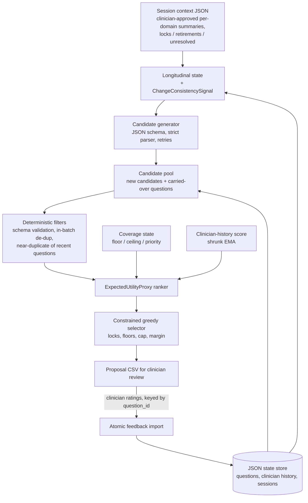

# Adaptive Questioning V2 — Technical Design

Status: **experimental research software**. V2 proposes questionnaire items for a licensed clinician to
review. It does not estimate risk, classify people, recommend dispositions, or talk to patients.

## 1. Design goals

1. **Stable identity and provenance** for every question (`question_id`, `parent_question_id`,
   prompt version, model), so that longitudinal analysis cannot mix up questions.
2. **Structured generation.** A JSON-schema candidate pool with deterministic, auditable validation
   replaces free-text final answers.
3. **Explicit, inspectable selection.** Every component of the selection score is stored per item.
4. **Less redundancy** within a session and across sessions.
5. **Clinician-controlled coverage** (floor, ceiling, required domains, priority).
6. **Structured longitudinal context** in place of raw note dumps, with conservative change flags.
7. **Clinician feedback kept raw.** The five dimensions are stored as entered and never overwritten.
   Composites are derived from them.
8. **Fail loudly** on integrity problems (corrupted state, invalid feedback, unknown ids).
9. **Credential-free reproducibility** through fixtures and a deterministic evaluation.
10. **The V1 algorithm stays reproducible**, and V1 and V2 can be compared on the same inputs.

## 2. Non-goals

- Diagnosis, risk estimation or classification, triage, disposition, or crisis handling.
- Replacing, rewording or de-selecting validated instruments (ASQ, C-SSRS, …).
- A patient-facing chatbot.
- Expected information gain. There is no calibrated measurement model
  (`InformationGainEstimator` is an interface only: *not implemented/calibrated in V2*).
- Automatic summarisation of clinical notes. V2 consumes clinician-written or clinician-approved
  per-domain summaries.
- Writing to the legacy Google Sheets layout. V2 runs on local state, and its output is a review CSV
  keyed by `question_id`.

## 3. Architecture



| Module | Responsibility |
|---|---|
| `v2/models.py` | Dataclasses: `Question`, `CandidateQuestion`, `SessionQuestion`, `ClinicianFeedback`, `ChangeConsistencySignal`, `CategoryLongitudinalState`, `SelectionResult` |
| `v2/config.py` | `[adaptive_v2]` parsing and validation |
| `v2/candidate_generator.py` | Prompt construction, JSON schema, strict parsing, retries, backends (OpenAI JSON, fixture replay) |
| `v2/redundancy.py` | Similarity backends, batch de-duplication, redundancy metrics |
| `v2/coverage.py` | Coverage state, targets, floors, `coverage_need` |
| `v2/longitudinal.py` | Per-domain longitudinal state, change signal, relevance and longitudinal features |
| `v2/scoring.py` | Clinician-history score |
| `v2/ranker.py` | `ExpectedUtilityProxy`, `RankerWeights`, `InformationGainEstimator` (disabled) |
| `v2/selector.py` | Constrained greedy selection and stop reasons |
| `v2/engine.py` | Orchestration, JSON state store, feedback import, proposal CSV |
| `v2/instruments.py` | `ValidatedInstrumentAdapter` interface (no content shipped) |
| `v2/cli.py` | `v2_select`, `v2_import_feedback` |
| `legacy/` | Parity-tested V1 algorithm, parsing, provenance-based analysis |
| `evaluation/` | Synthetic world, runners, metrics |

## 4. Data model

- **Question**: `question_id` (opaque, never reused), `text`, `category`, `source`, `created_at`,
  `session_id` (creation session), `parent_question_id` (lineage only), `generation_model`,
  `prompt_version`, `initial_weight` (the prior), `current_weight` (clinician-history score; `None`
  until rated), `status` (`active | retired | locked | rejected`). `intent_id` exists only in
  synthetic fixtures.
- **CandidateQuestion**: `candidate_id`, `text`, `category`, the six component scores,
  `total_selection_score`, `selection_metadata` (rejection reason, rank, effective utility),
  `carried_question_id` (set for carried-over items).
- **SessionQuestion**: anonymous subject id, session id, `question_id`, `selected`,
  `displayed_order`, `clinician_scores` (raw), `clinician_notes`, `replacement_status`
  (`new | retained | locked`), `selection_score`, `selection_components`.
- **Identity rules**: a replacement always gets a new id. It never inherits history. Its
  `parent_question_id` is the most similar retired question in the same category, recorded for
  lineage only. Reordering rows has no effect, because everything is keyed by id.
- **Identifiers** must match `^[A-Za-z0-9_.-]{1,64}$` (opaque research ids). Session contexts with
  unknown keys are rejected, which prevents accidental PII fields.

## 5. Scoring and feature definitions

All features lie in [0, 1]. `sim` is the configured similarity backend.

| Feature | Definition | Notes |
|---|---|---|
| `relevance(q)` | `sim(q, current_summary[cat])`, or 0 without a summary | context fit |
| `novelty(q)` | new: `1 − max sim(q, questions asked in the last `history_sessions`)`; carried: `carryover_novelty` (0.5) | the carried value is a neutral design choice |
| `coverage(q)` | `max(0, target_c − n_c) / target_c` in the current selection | `target_c` ∝ priority, clamped to [floor, ceiling] |
| `longitudinal(q)` | `sim(q, current_summary[cat])` if the domain is changed or unresolved, else 0 | overlaps with relevance (ablation: marginal) |
| `clinician_history(q)` | carried: shrunk EMA score; new: `new_question_prior` | see §5.1 |
| `redundancy(q)` | `max sim(q, already selected)` | dynamic, MMR-style |

```
selection_score = w_r·relevance + w_n·novelty + w_c·coverage + w_l·longitudinal + w_h·clinician_history − w_d·redundancy
effective utility = selection_score − replacement_margin   (new candidates only)
```

Defaults: `w_r = 0.25, w_n = 0.20, w_c = 0.20, w_l = 0.15, w_h = 0.30, w_d = 0.40`, margin `0.05`.
These are **engineering defaults, not validated or tuned clinical values.** The evaluation found they
are **not backend-invariant**: embedding similarities shift novelty by about 0.27 on average
(docs/V2_EVALUATION.md).

### 5.1 Clinician-history score

$x_t = (\bar s_t - 1)/4$ over the *rated* dimensions. Then $ema_t = (1-\alpha)\,ema_{t-1} + \alpha x_t$
and $score = (n\cdot ema + k\cdot prior)/(n + k)$, with α = 0.5, k = 2, prior = 0.5.

This representation was chosen after a simulation (`experiments/simulate_weighting.py` →
`outputs/evaluation/weighting_simulation.md`) against five alternatives:

- the legacy additive rule is unbounded (down to −7.3 over 50 random sessions), counts missing
  ratings as 0, and decays under steady average ratings;
- a clipped additive rule saturates;
- a running mean goes inert;
- a z-score is undefined in common cases;
- a plain EMA over-reacts to the first rating.

Trade-offs are documented in the simulation output. Missing ratings never update state. Out-of-range,
NaN or inf input raises an error.

### 5.2 Legacy weight (V1) — unchanged

$w' = w + 0.2(f - 4)$, two lowest per category replaced, new questions at 0.5. The rule is kept
exactly, and `legacy_strict_validation` only refuses to apply it to blank, partial or out-of-range
scores.

## 6. Selection and replacement lifecycle

1. Load state and validate integrity. Refuse duplicate sessions.
2. Carried pool = the previous session's selected questions, minus clinician retirements, rejected
   items, and categories no longer in scope. Locked questions are always kept.
3. Build the longitudinal state and change signals from the previous and current summaries.
4. Plan slots per category (floors first, then an even spread of the replacement budget), request
   `slots × candidates_per_slot` candidates, parse, and retry up to `max_generation_attempts`.
5. De-duplicate within the batch. Drop new candidates that are near-duplicates of recently asked
   questions.
6. Greedy loop until `max_questions`:
   - restrict to under-floor categories when the remaining slots can only just satisfy the floors;
   - skip saturated categories;
   - skip new candidates once `max_replacements_per_session` is reached (the cap does not apply to a
     first session);
   - skip near-duplicates of the selection;
   - pick the highest effective utility; ties go to carried-over items.
7. Stop reasons (engineering only): size reached; no eligible non-redundant candidates; replacement
   cap reached with no carried items left; *experimental* `adaptive_length`, where utility is below
   `stop_min_utility` after `min_questions` → "adaptive follow-up generation complete".
8. Materialise: new questions get new ids and a fresh clinician-history state. Unselected carried
   questions become `retired`. Persist atomically.
9. Clinician review happens outside the software. Ratings are imported by `question_id`: atomic,
   blank means not rated, unknown or duplicate ids reject the whole import, and a session can be
   imported only once.

Shortfalls, such as too few eligible questions to meet a floor, produce warnings. They are never
filled with invented items.

## 7. Longitudinal handling

Per category: `prior_summary`, `current_summary`, `changed`, `unresolved` (clinician-marked),
`last_asked_session`, `times_asked_recent`, `clinician_priority`. `changed_state_possible` is true when
`sim(prior, current) < change_similarity_threshold` (0.6).

The signal's rationale text is fixed and neutral: *"may reflect genuine change, context, or measurement
noise. For clinician review only."* It only raises the relevance of clarifying follow-ups. It is never
used as evidence about the person.

Known limitation, measured on the synthetic bank's note variants: the **lexical** backend raised a
false change flag for **13 of 15** re-phrased but unchanged summaries (while flagging 15 of 15 true
changes). The **semantic** backend flagged 0 of 15 falsely and 13 of 15 true changes. Under the
lexical backend the longitudinal feature is therefore switched on almost all the time and largely
duplicates relevance, which is consistent with its marginal ablation effect. For change signals,
prefer the semantic backend, and treat lexical-backend signals as low-specificity. Clinicians can
ignore any signal; it is only a review flag.

## 8. Configuration (`[adaptive_v2]`)

| Key | Default | Meaning |
|---|---|---|
| `candidates_per_slot` | 3 | candidates requested per open slot |
| `max_questions` / `min_questions` | 20 / 10 | size cap; floor used only with `adaptive_length` |
| `min_per_category` / `max_per_category` | 2 / 6 | clinician-controlled floor and ceiling |
| `required_categories` | all | categories the floor applies to |
| `category_priority` | 1.0 each | e.g. `Mood:2, Goals:0.5` |
| `max_replacements_per_session` | 10 | new items per session once history exists (V1: always 10) |
| `replacement_margin` | 0.05 | switching cost against churn |
| `w_relevance … w_redundancy` | see §5 | experimental coefficients |
| `near_duplicate_threshold` | 0.80 | hard filter (engineering, not validated) |
| `change_similarity_threshold` | 0.60 | change-signal threshold |
| `redundancy_backend` | `auto` | `auto` / `lexical` / `sentence_transformers` / `openai` |
| `embedding_model` | multilingual MiniLM | local model for `sentence_transformers` |
| `history_sessions` | 3 | sessions used for novelty and repetition |
| `ema_alpha`, `prior_strength`, `new_question_prior` | 0.5, 2, 0.5 | clinician-history score |
| `carryover_novelty` | 0.5 | novelty assigned to carried items |
| `adaptive_length`, `stop_min_utility` | false, 0.0 | experimental early stop |
| `prompt_version`, `max_generation_attempts`, `max_question_chars` | v2-candidates-1, 3, 300 | generation |

Related sections: `[adaptive] mode` / `legacy_strict_validation`, `[privacy] log_clinical_text`, and
`[api_google] scopes`.

## 9. Failure modes and handling

| Failure | Behaviour |
|---|---|
| Malformed LLM output or schema violation | item rejected and counted; retry until at least one valid item or attempts run out |
| Transient API error (429/5xx/timeouts) | bounded exponential backoff (OpenAI and Sheets); permanent errors raise immediately |
| Corrupted or truncated state, dangling references, version mismatch | `StateIntegrityError`; never silently reset |
| Duplicate session or double feedback import | refused |
| Unknown, duplicate or out-of-range feedback | whole import rejected; nothing applied |
| Unknown lock/retire ids, unknown categories, PII-like ids | `ValueError` |
| Floor not satisfiable | warning; no invented items |
| Non-finite feature | `FloatingPointError` (unreachable with validated inputs; defensive) |
| Legacy: blank, partial or out-of-range scores | patient skipped, reported, exit code 2 (strict mode) |
| Legacy: unparseable questionnaire | tab not created, reported |

## 10. Evaluation methodology

See `docs/V2_EVALUATION.md`. In short: a seeded synthetic world with hidden intent labels (ground-truth
redundancy independent of V2's similarity function), injected change onsets, and simulated ratings
independent of V2's features. V1 is simulated with the parity-tested legacy functions, and V2 runs as
the real engine. A random control and ablations are included. The primary proxies and the decision
rule were fixed before running, and patients are the bootstrap unit. Clinical accuracy is not
evaluated.

## 11. Open research questions

1. Which coverage floor and domain priorities are clinically appropriate? *(clinician input)*
2. Coefficient calibration, including backend invariance; the current values are untuned
   *(de-identified clinician ratings, prospective study)*.
3. Do clinicians actually rate V2-selected items as more useful than V1 items, blinded?
   *(clinician study)*
4. Would a properly specified measurement model (IRT/CAT) make information-gain selection feasible
   for any construct here? *(psychometric validation)*
5. Performance on Greek text, and on real (not simulated) LLM candidate pools.
6. False change-signal rate on real summaries, and whether signals help or distract clinicians.
7. Whether any of this changes patient-relevant outcomes. That needs a prospective clinical
   evaluation with appropriate ethics approval. This software makes no such claim.
